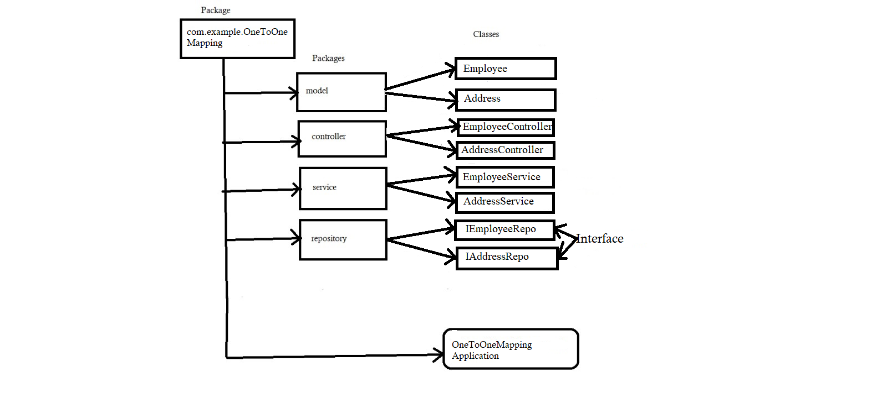

## Frameworks and language used 
* SpringBoot Framework and java language.
## Data Flow

## Data Structure used in your project
* Arraylist
## Project Summary

This is the "One-To-One Mapping" Employee-Address Application which following the mvc-Architecture.I have used here MySQl Database and JPA Dependency to connect with Database and get the Information in the form of Tables. I have created a package of OneToOneMapping within this package I have created Four more packages to define layer as given in DFD. In this project a I have define Model "Employee" And "Address" which maintaing the one to one relationship which has the attributes which making our application in readable format So here we are making our data readable by performing crud operations on it with the help of endpoints like @GetMapping to get all the data of the Employee And Address , @PostMapping to create a Employee And Address using the attributes,
@PutMapping to update the perticular Address And Employee By Passing needed Attribute which information we want to update using their Id, @deleteMapping to remove a Employee And Address from list by giving specific Id. That's the whole project meant. 